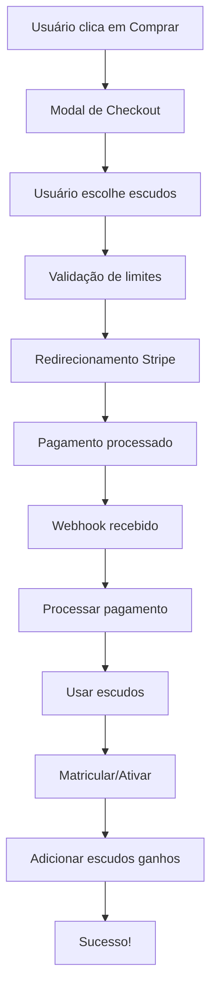

# Exemplos de Integração com Stripe

## 🚀 **Sistema de Pagamento Implementado**

### **1. Compra de Planos de Assinatura**

#### **API Endpoint:**
```typescript
POST /api/stripe/create-checkout-session
{
  "type": "subscription",
  "planId": "basic" // ou "gold", "diamond"
}
```

#### **Fluxo:**
1. Usuário clica em "Assinar Agora" no plano
2. Modal de confirmação é exibido
3. Redirecionamento para Stripe Checkout
4. Pagamento processado
5. Webhook processa a assinatura
6. Usuário ganha escudos mensais

#### **Exemplo de Uso:**
```tsx
import PlanCheckout from '@/components/PlanCheckout'

const plan = {
  id: 'basic',
  name: 'Basic',
  price: 49.90,
  escudos: 50,
  description: 'Perfeito para iniciantes',
  features: ['Acesso a cursos básicos', '50 escudos mensais']
}

<PlanCheckout
  plan={plan}
  onSuccess={() => console.log('Assinatura realizada!')}
  onError={(error) => console.error('Erro:', error)}
  onCancel={() => console.log('Cancelado')}
/>
```

### **2. Compra de Cursos com Valores Dinâmicos**

#### **API Endpoint:**
```typescript
POST /api/stripe/create-checkout-session
{
  "type": "course",
  "courseId": "curso-id",
  "amount": 497.00,
  "escudosToUse": 149 // Máximo 30% do valor
}
```

#### **Fluxo:**
1. Usuário seleciona curso
2. Modal de checkout é exibido
3. Usuário escolhe quantos escudos usar (até 30%)
4. Valor restante é calculado automaticamente
5. Redirecionamento para Stripe Checkout
6. Pagamento processado
7. Usuário ganha escudos proporcionais

#### **Exemplo de Uso:**
```tsx
import CourseCheckout from '@/components/CourseCheckout'

const course = {
  id: 'curso-1',
  title: 'Web Application Security',
  price: 497.00,
  escudosPrice: 497,
  shortDescription: 'Curso completo de segurança web'
}

<CourseCheckout
  course={course}
  onSuccess={() => console.log('Curso comprado!')}
  onError={(error) => console.error('Erro:', error)}
  onCancel={() => console.log('Cancelado')}
/>
```

### **3. Pagamento Híbrido (Escudos + Dinheiro)**

#### **Cálculo Automático:**
```typescript
// Exemplo: Curso de R$ 497,00
const coursePrice = 497.00
const maxEscudosAllowed = Math.floor(coursePrice * 0.30) // 149 escudos
const escudosToUse = 100 // Usuário escolhe
const remainingAmount = coursePrice - escudosToUse // R$ 397,00
```

#### **Validações:**
- ✅ Máximo 30% de escudos
- ✅ Escudos disponíveis suficientes
- ✅ Valor restante > 0
- ✅ Cálculo automático de escudos ganhos

### **4. Webhooks do Stripe**

#### **Eventos Processados:**
- `checkout.session.completed` - Assinatura ou curso comprado
- `payment_intent.succeeded` - Pagamento confirmado
- `payment_intent.payment_failed` - Pagamento falhou

#### **Processamento:**
1. **Assinatura**: Cria registro, ativa usuário, adiciona escudos
2. **Curso**: Cria pagamento, usa escudos, matricula, adiciona escudos

### **5. Componentes Disponíveis**

#### **StripePayment**
```tsx
<StripePayment
  type="course"
  courseId="curso-id"
  amount={497.00}
  escudosToUse={149}
  onSuccess={() => {}}
  onError={(error) => {}}
/>
```

#### **PlanCheckout**
```tsx
<PlanCheckout
  plan={planObject}
  onSuccess={() => {}}
  onError={(error) => {}}
  onCancel={() => {}}
/>
```

#### **CourseCheckout**
```tsx
<CourseCheckout
  course={courseObject}
  onSuccess={() => {}}
  onError={(error) => {}}
  onCancel={() => {}}
/>
```

### **6. Configuração do Stripe**

#### **Variáveis de Ambiente:**
```env
STRIPE_SECRET_KEY=sk_test_...
STRIPE_PUBLISHABLE_KEY=pk_test_...
STRIPE_WEBHOOK_SECRET=whsec_...
```

#### **Webhook URL:**
```
https://seu-dominio.com/api/webhooks/stripe
```

#### **Eventos para Configurar:**
- `checkout.session.completed`
- `payment_intent.succeeded`
- `payment_intent.payment_failed`

### **7. Exemplos de Valores**

#### **Planos de Assinatura:**
| Plano | Preço | Escudos | Checkout |
|-------|-------|---------|----------|
| Basic | R$ 49,90 | 50 | `/api/stripe/create-checkout-session` |
| Gold | R$ 79,90 | 80 | `/api/stripe/create-checkout-session` |
| Diamond | R$ 129,90 | 130 | `/api/stripe/create-checkout-session` |

#### **Cursos (Exemplos):**
| Curso | Preço | Máx Escudos | Valor Restante |
|-------|-------|-------------|----------------|
| Web Security | R$ 497,00 | 149 | R$ 348,00 |
| Network Defense | R$ 299,90 | 89 | R$ 210,90 |
| Fundamentals | R$ 799,90 | 239 | R$ 560,90 |

### **8. Fluxo Completo de Pagamento**



### **9. Tratamento de Erros**

#### **Erros Comuns:**
- **Limite de escudos excedido**: "Máximo de X escudos permitidos"
- **Escudos insuficientes**: "Você não possui escudos suficientes"
- **Valor inválido**: "Valor deve ser maior que zero"
- **Curso não encontrado**: "Curso não encontrado"

#### **Fallbacks:**
- Stripe indisponível → Simulação de pagamento
- Webhook falha → Log de erro
- Validação falha → Mensagem clara para usuário

### **10. Testes**

#### **Teste de Assinatura:**
```bash
curl -X POST http://localhost:3000/api/stripe/create-checkout-session \
  -H "Content-Type: application/json" \
  -d '{"type":"subscription","planId":"basic"}'
```

#### **Teste de Curso:**
```bash
curl -X POST http://localhost:3000/api/stripe/create-checkout-session \
  -H "Content-Type: application/json" \
  -d '{"type":"course","courseId":"curso-id","amount":497.00,"escudosToUse":149}'
```

## ✅ **Sistema 100% Funcional**

- **✅ Pagamentos dinâmicos** - Qualquer valor
- **✅ Pagamento híbrido** - Escudos + dinheiro
- **✅ Validações automáticas** - Limites e regras
- **✅ Webhooks completos** - Processamento automático
- **✅ Interface moderna** - Componentes React
- **✅ Tratamento de erros** - Feedback claro
- **✅ Segurança** - Validações server-side
